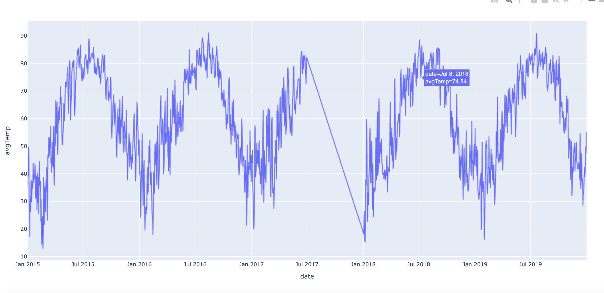
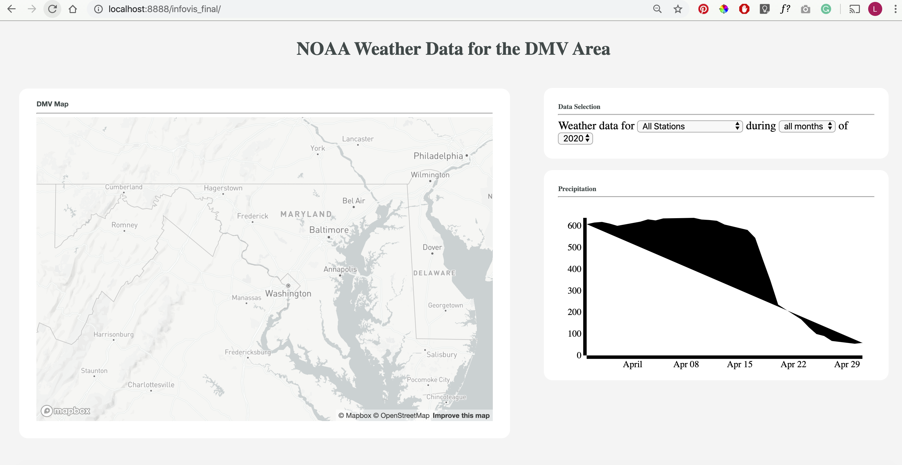

# NOAA Weather Data for the DMV Area (M4)
As of now, we have displayed a map that shows the weather stations represented by red circles, similar to that of Homework 2. We used Homework 2 as a reference to figure out how to display nodes on the map. We have yet to figure out how to implement a hover feature over the nodes and show specific details on that weather station. We will have to find some tutorials online of how to do that. 

We were working on line graphs with D3 and the NOAA API, but came into a lot of non-descriptive errors, so we switched to Plot.ly and Python requests so we could test the API data; the python file in the repo gets average temperature data for 2015-2020 for the Ronald Reagan Airport weather station and outputs a Plot.ly graph. Now that we’ve got the API to work and have seen what the output data looks like, we need to move it over to JS so we can insert a line graph with the API data into our HTML dashboard. 

One major suggestion we received during Milestone 3, was to structure our interface in the form of a dashboard that does not require scrolling. We are arranged the different elements to ensure that all fit on the screen at once. Because the dataset is so large, we will have to find a way to organize it in terms of months and years. We haven’t gotten to the more existential edits yet because we want to get a working interface that allows the user to select a station on the map, gets the NOAA data for that station and the selected month/year, and populates the NOAA data on a line graph before tackling anything else.

